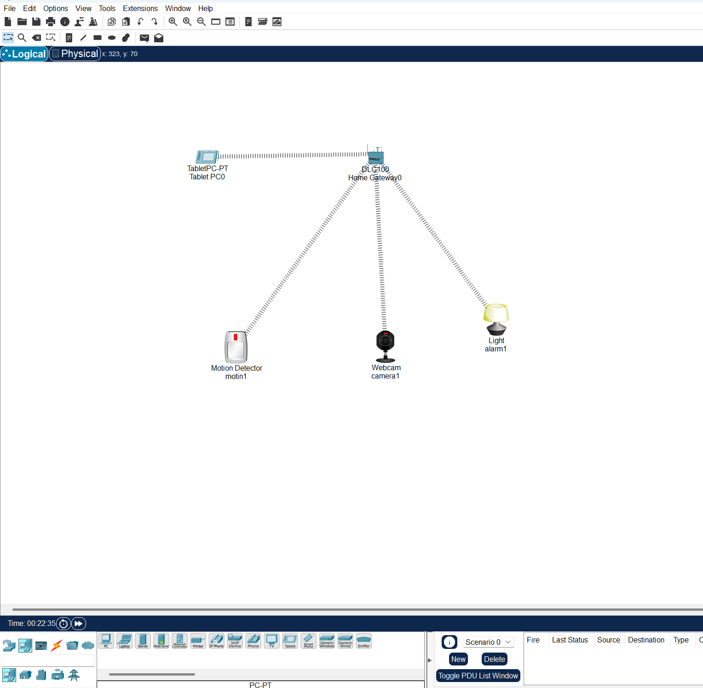

# Surveillance & Motion Sensor Alert System
*Applied Industrial Internet of Things (IIoT) Project*

##  Aim
To design and simulate an IoT-based surveillance system using Cisco Packet Tracer that detects motion and immediately alerts the user by activating a smart alarm and surveillance camera.

---

##  Problem Statement
Traditional surveillance systems require continuous manual monitoring and lack instant response capabilities.  
This project implements an IoT-based motion detection system where a motion detector triggers alerts and camera activation, thereby reducing human dependency and improving response speed.

---

##  Scope of the Solution
- Applicable for *homes, offices, warehouses, and industrial areas*.  
- Real-time *motion detection + alert notification*.  
- Camera activation for better surveillance.  
- Provides *low-cost simulation* before real-world deployment.  
- Can be extended with IoT servers, cloud integration, and mobile app notifications.

---

##  Required Components

### *Software*
- Cisco Packet Tracer (IoT Workspace)  
- Screen Recorder   
- GitHub (for project submission)  
### *Simulated IoT Hardware (in Packet Tracer)*
- Motion Detector  
- IoT Camera  
- Smart Lamp 
- Home Gateway (or Router + Switch)  
- Tablet (for monitoring/logs)  

---

##  Simulated Circuit
The basic topology connects Motion Detector, Camera, and Smart Lamp to the Home Gateway.  
When motion is detected → Smart Lamp turns ON and Camera activates. 

/open in repository

---

##  Demo Video   
*(Open demo.gif in this repository to view the working.)*

---

##  Working Steps
1. Open the .pkt file in Cisco Packet Tracer.  
2. Ensure all devices are connected to the Home Gateway.  
3. Motion Detector Rules:  
   - *On Motion Detected → Lamp ON + Camera ON*  
   - *On No Motion → Lamp OFF + Camera OFF*  
4. Run simulation or realtime mode to test.  

---

##  Repository Contents
- surveillance_motion_070925.pkt → Cisco Packet Tracer simulation file  
- circuit.png → Screenshot of simulated circuit  
- demo.mp4 → Demo video of the system working  
- README.md → Project documentation (this file)  

---
##  Author
*KAYI PERTIN, DOVEI MICHAEL, SUGAM SUBEDI, MOHAMMED IBRAHIM K MEHKRI*  
B.Tech Students | Applied Industrial IoT Project
